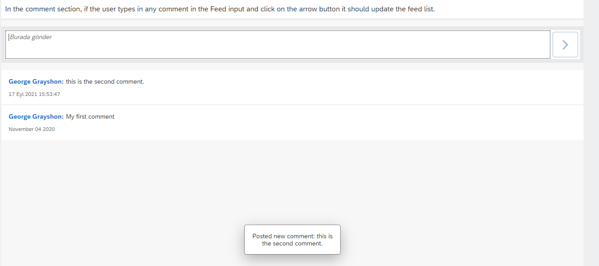

### Application Runtime


#### When we click to arrow.



## Application Details
|               |
| ------------- |
|**Generation Date and Time**<br>Fri Sep 17 2021 14:11:05 GMT+0300 (GMT+03:00)|
|**App Generator**<br>@sap/generator-fiori|
|**App Generator Version**<br>1.3.2|
|**Generation Platform**<br>Visual Studio Code|
|**Floorplan Used**<br>simple|
|**Service Type**<br>None|
|**Service URL**<br>N/A
|**Module Name**<br>case_one|
|**Application Title**<br>Add to List|
|**Namespace**<br>|
|**UI5 Theme**<br>sap_fiori_3|
|**UI5 Version**<br>Latest|
|**Enable Code Assist Libraries**<br>False|
|**Enable Telemetry**<br>True|

## case_one

 In the comment section, if the user types in any comment in the Feed input and click on the arrow button it should update the feed list.

### Starting the generated app

-   This app has been generated using the SAP Fiori tools - App Generator, as part of the SAP Fiori tools suite.  In order to launch the generated app, simply run the following from the generated app root folder:

```
    npm start
```

#### Pre-requisites:

1. Active NodeJS LTS (Long Term Support) version and associated supported NPM version.  (See https://nodejs.org)


